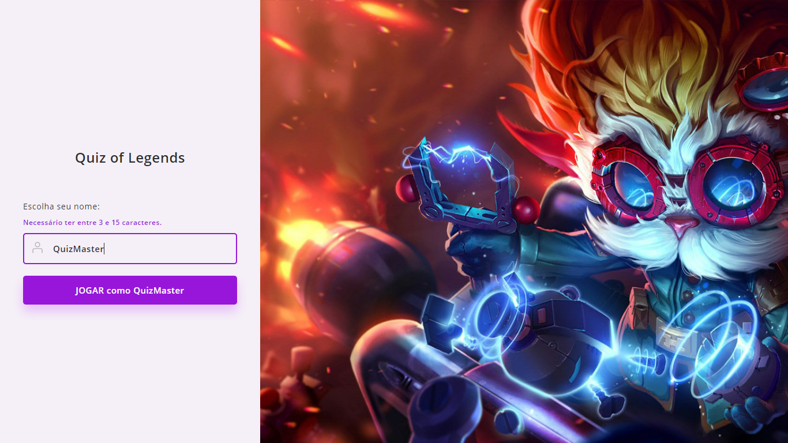
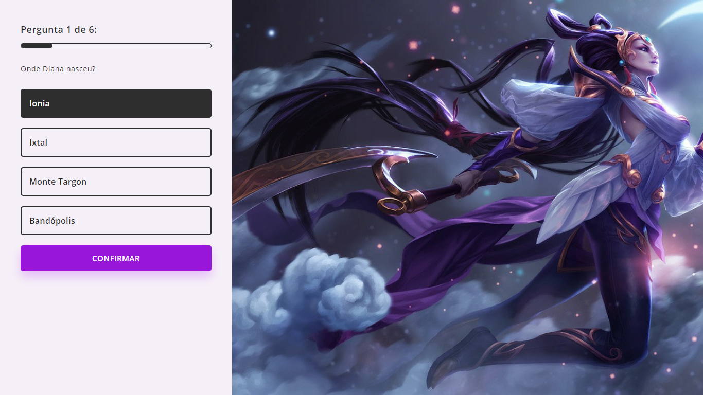

# LOLQUIZ

## Sobre o Projeto

Este projeto é um jogo de Quiz, ele foi desenvolvido durante a 2ª edição da **Imersão React - Next.js**, evento realizado pela [Alura](https://www.alura.com.br), e ministrado por Mario Souto, Juliana Amoasei, e participação do Paulo Silveira.  

## Preview

### Home

### Game

## Tecnologias usadas :wrench:
- [React.js](https://pt-br.reactjs.org)
- [Next.js](nextjs.org)
- [Styled Components](https://styled-components.com)
- [Lottie](https://lottiefiles.com)
